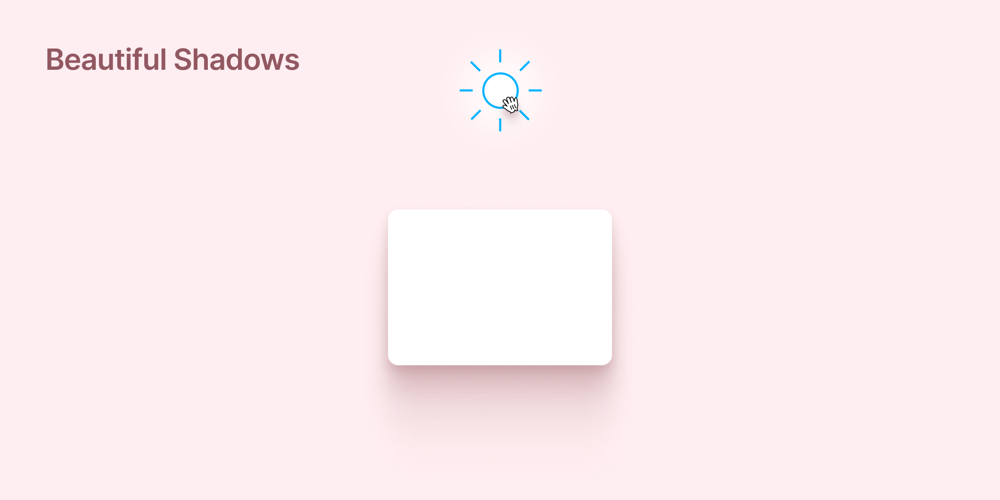

Create beautiful, smooth shadows in Figma.
The plugin allows the user to create realistic shadows by adding a 'light source' which casts a shadow on selected elements.

Instead of thinking in abstract offsets, radius and spreads, the shadows are parameterized by `azimuth` (angle between light and element), `distance` (between light and element), `brightness` (of the light source) and `elevation` (of the shadow-receiving element).

The shadow effect is achieved by layering and easing multiple drop-shadows to create a skeuomorphic umbra and penumbra.

The plugin is cultivated by [Josh W. Comeau's](https://www.joshwcomeau.com/) amazing resource and read about [Designing beautiful shadows in CSS](https://www.joshwcomeau.com/css/designing-shadows/).

## 🌀 Misc

This plugin uses the amazing [create-figma-plugin](https://github.com/yuanqing/create-figma-plugin) library.

## 📝 License

[MIT](LICENSE)
